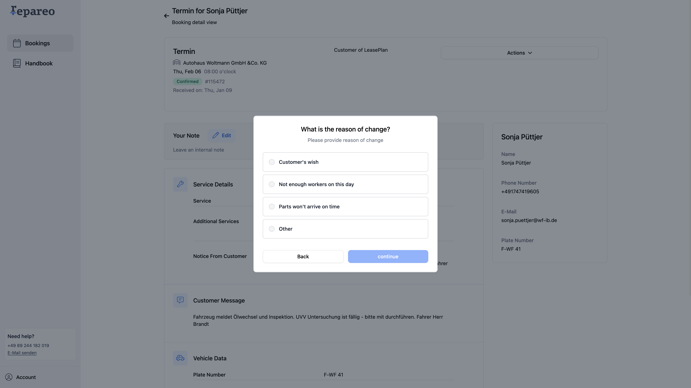

# Repareo Garage Dashboard

Source Code of Garage Dashboard Repository

## Getting Started

First, install the dependencies:

```bash
npm install
# or
yarn install
# or
pnpm install
# or
bun install
```

Then, run the development server:

```bash
npm run dev
# or
yarn dev
# or
pnpm dev
# or
bun dev
```

Open [http://localhost:3000](http://localhost:3000) with your browser to see the result.

## Using Mock Data

This application can run in a fully mocked mode to facilitate development and testing without requiring a backend connection.

### How to run the project with mock data

1. Start the development server as described above
2. Navigate to the login page
3. Use the following credentials:
   - Email: `email`
   - Password: `password`

The application will automatically use mock data for all API requests when in mock mode. The system works as follows:

- When you login with the mock credentials, a special token is set that identifies mock mode
- All API requests will first check for local mock data files in the `mock-data/` directory
- If mock data for an endpoint is found, it will be used regardless of backend availability
- If no mock data is found but you're in mock mode, default empty responses will be returned
- The system is fully functional without any backend connection

### Creating custom mock data

You can create your own mock data files for specific endpoints:

1. Create JSON files in the `mock-data/` directory following the naming convention:

   ```
   mock-METHOD-endpoint_path.json
   ```

   For example: `mock-GET-_user_filters.json`

2. The mock data system will automatically use these files when the corresponding endpoint is called.

## App Structure

We are using the App Router in Next.js with the following folder naming convention:

```bash
(auth)
```

and

```bash
(dashboard)
```

Routes in brackets are ignored by the NextJS router. We follow this convention to semantically group the routes in two categories:

- **(auth)** includes the routes that the user should be able to access when NOT authenticated (e.g., /login, /register, etc.)
- **(dashboard)** includes the main application routes that should be accessible upon authentication

## Screenshots

The application includes various views and components:

- **List View**: A comprehensive view of all records
  

- **List with Filters**: Filtered view of records
  

- **List Actions**: Available actions for list items
  

- **Detail View**: Detailed information about a specific record
  

- **Modal Flow**:

  - Step 1: 
  - Step 2: 
  - Step 3: 

- **Cancelled State**:
  

## Learn More

To learn more about Next.js, take a look at the following resources:

- [Next.js Documentation](https://nextjs.org/docs) - learn about Next.js features and API.
- [Learn Next.js](https://nextjs.org/learn) - an interactive Next.js tutorial.

## Deploy on Vercel

The easiest way to deploy your Next.js app is to use the [Vercel Platform](https://vercel.com/new?utm_medium=default-template&filter=next.js&utm_source=create-next-app&utm_campaign=create-next-app-readme) from the creators of Next.js.

Check out our [Next.js deployment documentation](https://nextjs.org/docs/deployment) for more details.
